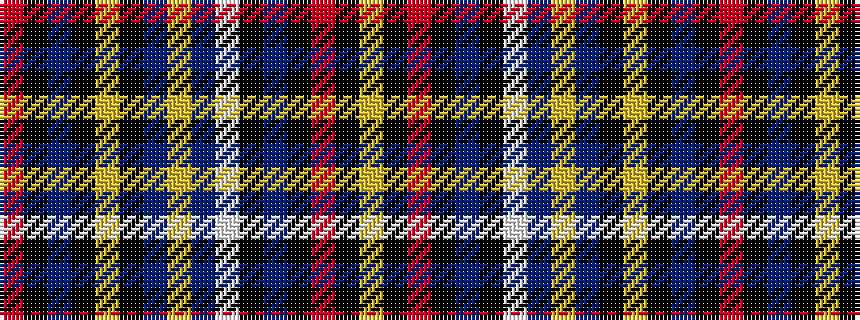

RKBKYKBYBWKBKRKY

It is a 16 stripe tartan.

<figure class="pat-woven">

<figcaption>idealised sample</figcaption>
</figure>

## Colour Sequence



## Tartans with this colour sequence

| Tartans |
|---------------|
| [Westmeath County Crest (Fashion)](/variants/s16/r4k1db8k1lo3k2db4lo6db4w3k2db20k4r21k1lo3~x2/)|
||
