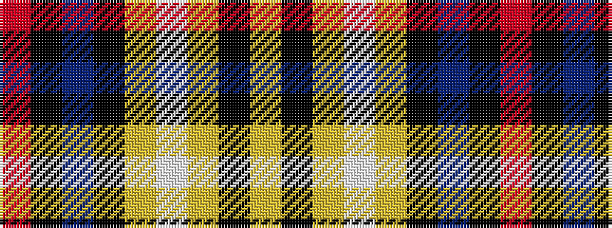

RKBKYWYKY

It is a 9 stripe tartan.

<figure class="pat-woven">

<figcaption>idealised sample</figcaption>
</figure>

## Colour Sequence



## Tartans with this colour sequence

| Tartans |
|---------------|
| [Heart of the Highlands](/variants/s9/lr18k3lr4w3lr4k19n20k2m4~x2/)|
||
