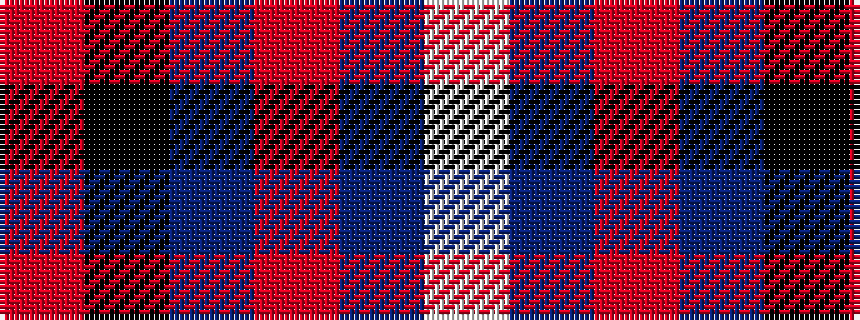

RKBRBW

It is a 6 stripe tartan.

<figure class="pat-woven">

<figcaption>idealised sample</figcaption>
</figure>

## Colour Sequence



## Tartans with this colour sequence

| Tartans |
|---------------|
| [Margach, William (Dumbarton)](/setts/s6/m4k3t18r3dp34w3~x2/)|
||
| [Margach, William (Personal)](/setts/s6/m4k3b18r3dt34w3~x2/)|
||
