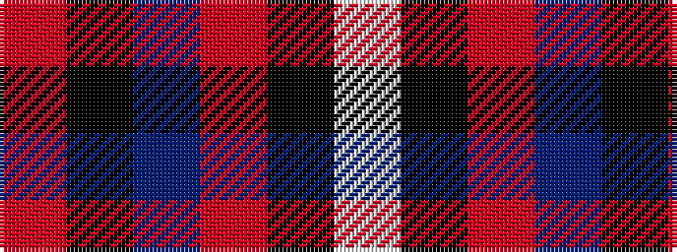

RKBRKW

It is a 6 stripe tartan.

<figure class="pat-woven">

<figcaption>idealised sample</figcaption>
</figure>

## Colour Sequence



## Tartans with this colour sequence

| Tartans |
|---------------|
| [Jewell of Kernow (Personal)](/variants/s6/w6k29o29dp7k3r3~x2/)|
||
