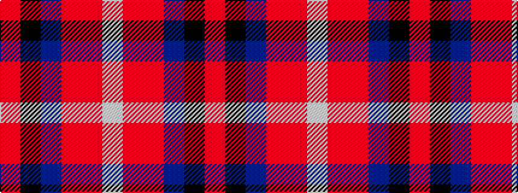

RKBRRW

It is a 6 stripe tartan.

<figure class="pat-woven">

<figcaption>idealised sample</figcaption>
</figure>

## Colour Sequence



## Tartans with this colour sequence

| Tartans |
|---------------|
| [Commonwealth Games Council (Corp.)](/variants/s6/m3k17n11m2o20w2~x2/)|
||
