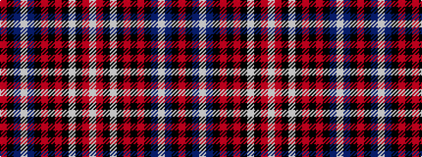

RKBWBKRKRKWKRW

It is a 14 stripe tartan.

<figure class="pat-woven">

<figcaption>idealised sample</figcaption>
</figure>

## Colour Sequence



## Tartans with this colour sequence

| Tartans |
|---------------|
| [University of Alabama (Corporate)](/variants/s14/m32k2n3w4n3k2m22k1m5k2w6k2m4w5~x2/)|
||
