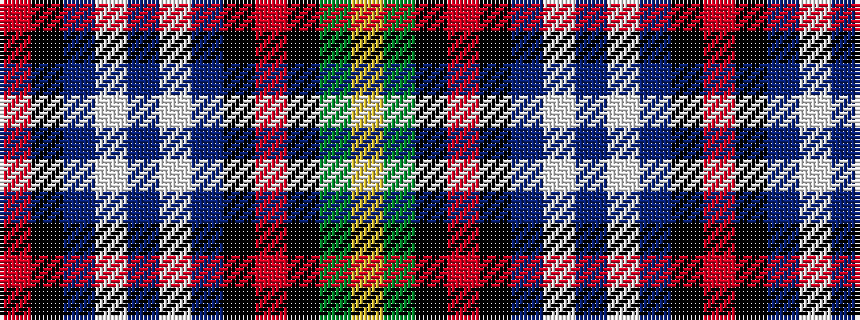

RKBWBWBKRKGY

It is a 12 stripe tartan.

<figure class="pat-woven">

<figcaption>idealised sample</figcaption>
</figure>

## Colour Sequence



## Tartans with this colour sequence

| Tartans |
|---------------|
| [Dunedin](/setts/s12/r1k1db4w1db1w1db4k1r1k1g4ly1~x4/)|
||
