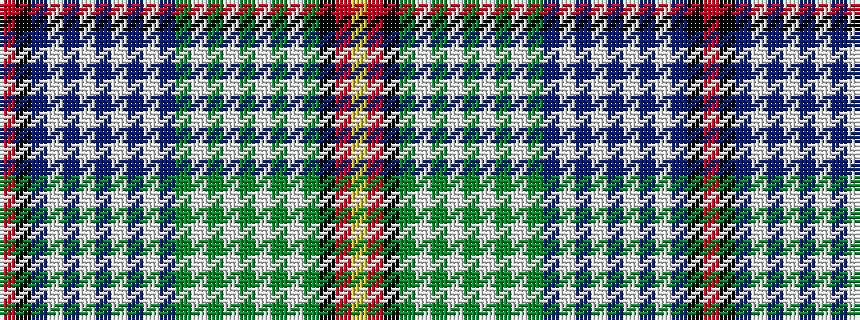

RKBWBWBWBWBGWGWGWGWGKRY

It is a 23 stripe tartan.

<figure class="pat-woven">

<figcaption>idealised sample</figcaption>
</figure>

## Colour Sequence



## Tartans with this colour sequence

| Tartans |
|---------------|
| [Lachine](/variants/s23/ly2r1k1g20w2g2w2g2w2g2w2g8t8w2t2w2t2w2t2w2t20k1r1~x2/)|
||
