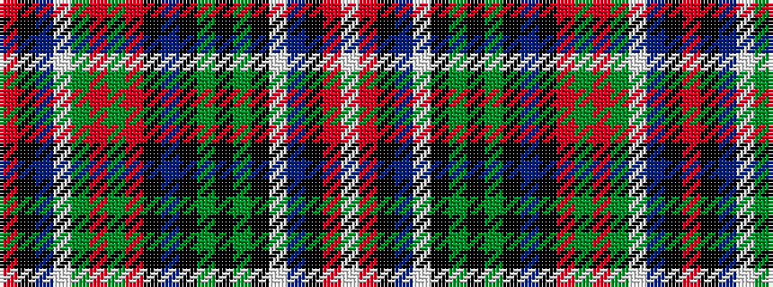

RKBWGRGRKBKGKGKWBKRW

It is a 20 stripe tartan.

<figure class="pat-woven">

<figcaption>idealised sample</figcaption>
</figure>

## Colour Sequence



## Tartans with this colour sequence

| Tartans |
|---------------|
| [Binder (2013)](/setts/s20/r2k27db10w1g9r2dg9r1k26db1k26dg9k1g9k2w1db10k25r2w2~x2/)|
||
