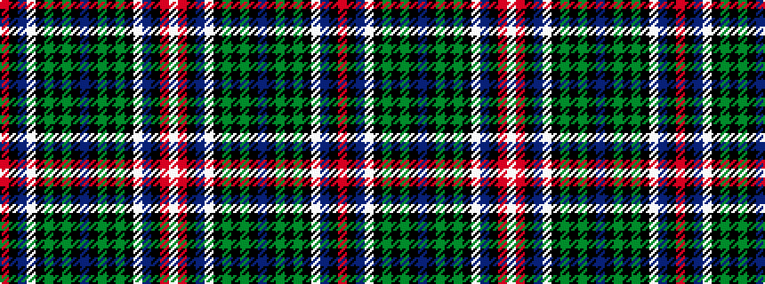

RKBWKGKGKBKGKGKWBKRW

It is a 20 stripe tartan.

<figure class="pat-woven">

<figcaption>idealised sample</figcaption>
</figure>

## Colour Sequence



## Tartans with this colour sequence

| Tartans |
|---------------|
| [Binder (2013)](/variants/s20/r2k26dt10w1k2g9k1dg9k26dt1k26dg9k1g9k2w1dt10k25r2w2~x2/)|
||
