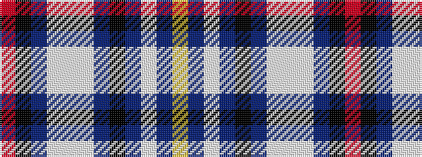

RKBWWWBKBWBY

It is a 12 stripe tartan.

<figure class="pat-woven">

<figcaption>idealised sample</figcaption>
</figure>

## Colour Sequence



## Tartans with this colour sequence

| Tartans |
|---------------|
| [Union Club of British Columbia](/variants/s12/o2k1n4lb4w1lb4t4k1t4lb2t4ly1~x4/)|
||
