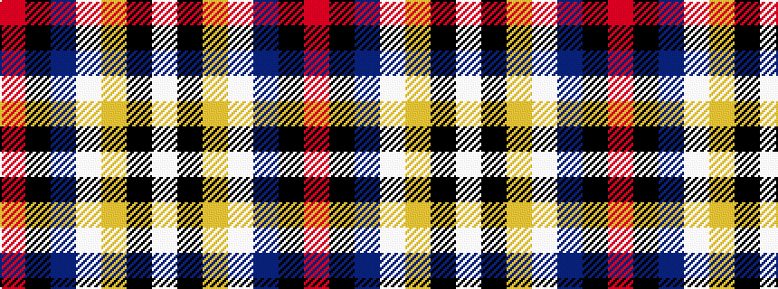

RKBWYKW

It is a 7 stripe tartan.

<figure class="pat-woven">

<figcaption>idealised sample</figcaption>
</figure>

## Colour Sequence



## Tartans with this colour sequence

| Tartans |
|---------------|
| [Pengelly, The Cornish](/variants/s7/w5k26ly4lb24dp8k3r4~x2/)|
||
| [Pengelly, The Cornish (Name)](/variants/s7/lb5k26ly4lb24dp8k3r4~x2/)|
||
