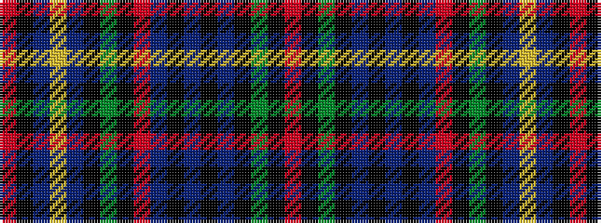

RKBYBKGKRBKBKBKGKR

It is a 18 stripe tartan.

<figure class="pat-woven">

<figcaption>idealised sample</figcaption>
</figure>

## Colour Sequence



## Tartans with this colour sequence

| Tartans |
|---------------|
| [Craig (Personal)](/setts/s18/r2k2db3lo1db20k1g18k1r2db2k1db2k1db2k2g2k2r2~x2/)|
||
