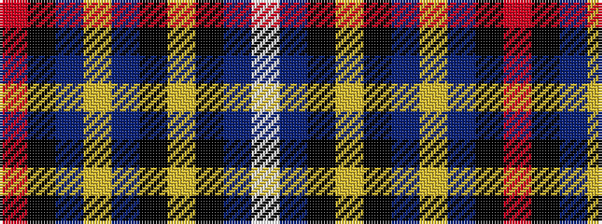

RKBYBKYKBW

It is a 10 stripe tartan.

<figure class="pat-woven">

<figcaption>idealised sample</figcaption>
</figure>

## Colour Sequence



## Tartans with this colour sequence

| Tartans |
|---------------|
| [European Union (Fashion)](/variants/s10/w4db32k1ly2k1db10ly18db10k1r2~x2/)|
||
