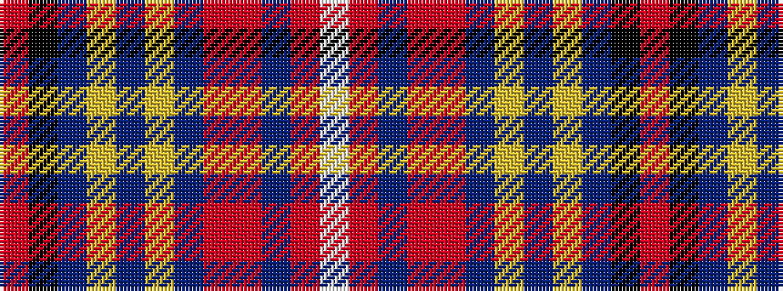

RKBYBYBRRBRW

It is a 12 stripe tartan.

<figure class="pat-woven">

<figcaption>idealised sample</figcaption>
</figure>

## Colour Sequence



## Tartans with this colour sequence

| Tartans |
|---------------|
| [Seller, Sillar](/setts/s12/o63k4t9ly2db4ly2db4o11r8t2r4w5~x2/)|
||
