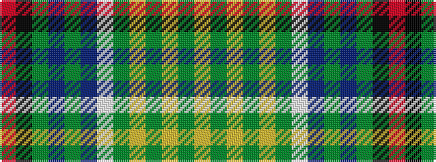

RKGBGBWGYGYGY

It is a 13 stripe tartan.

<figure class="pat-woven">

<figcaption>idealised sample</figcaption>
</figure>

## Colour Sequence



## Tartans with this colour sequence

| Tartans |
|---------------|
| [Ellis Island](/setts/s13/o68k1dg6b4dg1b12w1dg6ly1dg24ly1dg2ly3~x2/)|
||
| [Ellis Island (District)](/setts/s13/r68k1g6t4g1t12w1g6ly1g24ly1g2ly3~x2/)|
||
| [Ellis Island American District Tartan Tartan Number: 10364. Earliest known date: 06/02/10 The Ellis Island tartan has been designed by Matt Newsome, curator of the Scottish Tartans Museum in Franklin, NC, primarily for use by all Americans with ancestors who came to America through Ellis Island regardless of ethnic origin and to commemorate the 10th annual observance of National Tartan Day at the Ellis Island Immigration Museum. It was commissioned by the Clan Currie Society who hold the copyright. Proceeds from the sale of the tartan will benefit the Save Ellis Island Foundation and the Clan Currie Society. See products available Copyright © Blair Urquhart, Comrie, 2015](/setts/s13/r68k1g6t4g1t12w1g6lo1g24lo1g2lo3~x2/)|
|![Ellis Island American District Tartan Tartan Number: 10364. Earliest known date: 06/02/10 The Ellis Island tartan has been designed by Matt Newsome, curator of the Scottish Tartans Museum in Franklin, NC, primarily for use by all Americans with ancestors who came to America through Ellis Island regardless of ethnic origin and to commemorate the 10th annual observance of National Tartan Day at the Ellis Island Immigration Museum. It was commissioned by the Clan Currie Society who hold the copyright. Proceeds from the sale of the tartan will benefit the Save Ellis Island Foundation and the Clan Currie Society. See products available Copyright © Blair Urquhart, Comrie, 2015 example sett](/setts/s13/r68k1g6t4g1t12w1g6lo1g24lo1g2lo3~x2/sett.png)|
