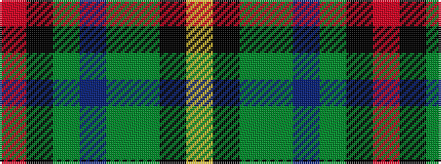

RKGBGGKY

It is a 8 stripe tartan.

<figure class="pat-woven">

<figcaption>idealised sample</figcaption>
</figure>

## Colour Sequence



## Tartans with this colour sequence

| Tartans |
|---------------|
| [Aberuchill](/setts/s8/m8k2dy10dp30dy30g55k4lo6/)|
||
