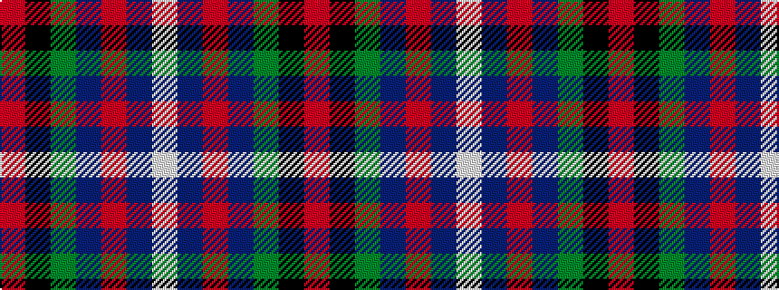

RKGBRBW

It is a 7 stripe tartan.

<figure class="pat-woven">

<figcaption>idealised sample</figcaption>
</figure>

## Colour Sequence



## Tartans with this colour sequence

| Tartans |
|---------------|
| [Genet, Citizen (Commem)](/variants/s7/r2k9g12db8r1db1w1~x4/)|
||
