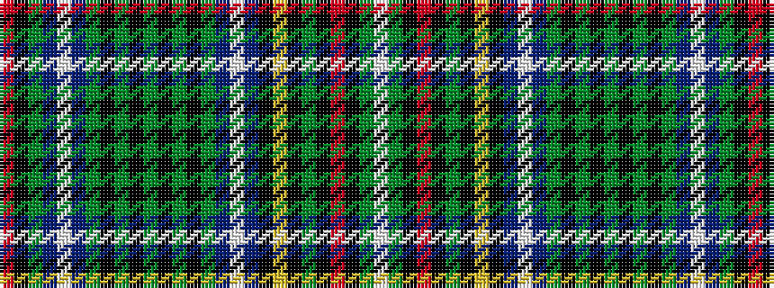

RKGBWBGKGKGKGKGBWBKYKGKRKGW

It is a 27 stripe tartan.

<figure class="pat-woven">

<figcaption>idealised sample</figcaption>
</figure>

## Colour Sequence



## Tartans with this colour sequence

| Tartans |
|---------------|
| [Cockburn](/variants/s27/r3k2g9db12w3db12g2k2g2k2g36k2g2k2g2db12w3db12k3ly3k2g12k2r3k2g6w3~x2/)|
||
| [Cockburn #2](/variants/s27/r3k2dg9db12w3db12dg2k2dg2k2dg36k2dg2k2dg2db12w3db12k3ly3k2dg12k2r3k2dg6w3~x2/)|
||
