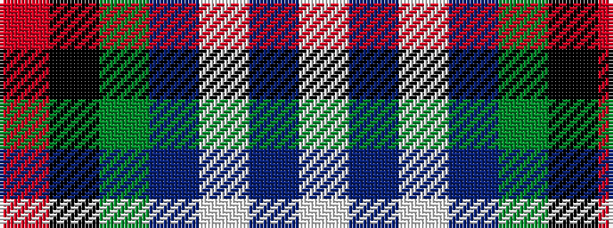

RKGBWBW

It is a 7 stripe tartan.

<figure class="pat-woven">

<figcaption>idealised sample</figcaption>
</figure>

## Colour Sequence



## Tartans with this colour sequence

| Tartans |
|---------------|
| [Clyde (Personal)](/setts/s7/r64k30g30b18w4b2w3/)|
||
| [Clyde Family (Hurleford) (Personal)](/setts/s7/r64k30g30db18w4db2w3/)|
||
