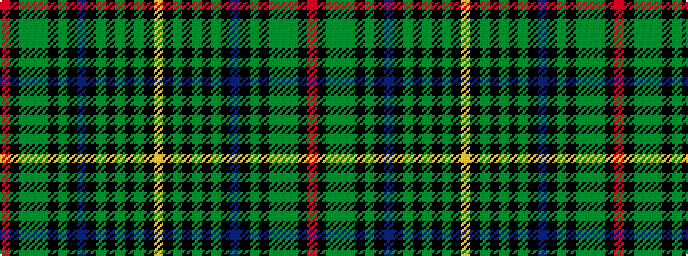

RKGGGKGKBKGKGKGKY

It is a 17 stripe tartan.

<figure class="pat-woven">

<figcaption>idealised sample</figcaption>
</figure>

## Colour Sequence



## Tartans with this colour sequence

| Tartans |
|---------------|
| [Redmond (2014)](/setts/s17/r4k1gi8g2gi8k4g8k1db2k1g8k4gi8k2gi8k1ly2~x2/)|
||
| [Redmond (2014)](/setts/s17/r4k1dg8g2dg8k4g8k1t2k1g8k4dg8k2dg8k1lo2~x2/)|
||
