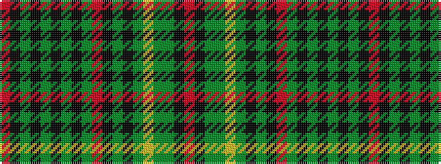

RKGGYGKGKRGKGKGKGKR

It is a 19 stripe tartan.

<figure class="pat-woven">

<figcaption>idealised sample</figcaption>
</figure>

## Colour Sequence



## Tartans with this colour sequence

| Tartans |
|---------------|
| [Craig](/setts/s19/r1k3g2k2y2k1y3k1y2r3k1g16k1y18ly1g1y2k2r1~x2/)|
||
