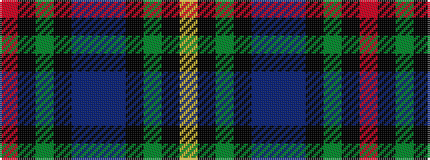

RKGKBBBKGKY

It is a 11 stripe tartan.

<figure class="pat-woven">

<figcaption>idealised sample</figcaption>
</figure>

## Colour Sequence



## Tartans with this colour sequence

| Tartans |
|---------------|
| [Gow Hunting](/setts/s11/r3k1dg12k12db12dbi3db12k12dg12k1ly3~x2/)|
||
| [Gow Hunting (Clan)](/setts/s11/r3k1g12k12dbi12db3dbi12k12g12k1ly3~x2/)|
||
| [Gow, hunting](/setts/s11/r3k1g12k12db12dbi3db12k12g12k1ly3~x2/)|
||
| [Smith](/setts/s11/r3k1g12k12db12t3db12k12g12k1ly3~x2/)|
||
| [Smith (Clan)](/setts/s11/r2k1g7k6n7ni2n7k6g7k1lo2~x4/)|
||
| [Smith of Pennilands (Clan)](/setts/s11/r2k1g7k6n7db2n7k6g7k1lo2~x4/)|
||
