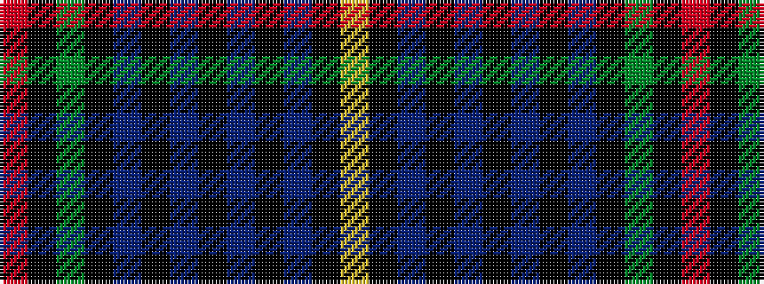

RKGKBKBKBKBKY

It is a 13 stripe tartan.

<figure class="pat-woven">

<figcaption>idealised sample</figcaption>
</figure>

## Colour Sequence



## Tartans with this colour sequence

| Tartans |
|---------------|
| [Gold-Smith (Personal)](/variants/s13/r2k25dy2k20do5k2do4k3do3k4do2k6ly2~x2/)|
||
| [Gold-Smith (Personal)](/variants/s13/r2k25dy2k20n5k2n4k3n3k4n2k6ly2~x2/)|
||
