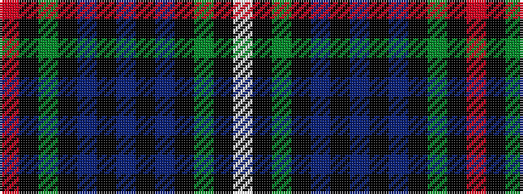

RKGKBKBKBKGKW

It is a 13 stripe tartan.

<figure class="pat-woven">

<figcaption>idealised sample</figcaption>
</figure>

## Colour Sequence



## Tartans with this colour sequence

| Tartans |
|---------------|
| [Campbell Red](/variants/s13/r3k1dg21k19db19k3db3k3db19k19dg21k1w3~x2/)|
||
| [Campbell, Red](/variants/s13/r3k1g21k19db19k3db3k3db19k19g21k1w3~x2/)|
||
