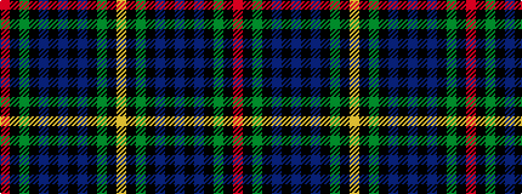

RKGKBKBKBKGKY

It is a 13 stripe tartan.

<figure class="pat-woven">

<figcaption>idealised sample</figcaption>
</figure>

## Colour Sequence



## Tartans with this colour sequence

| Tartans |
|---------------|
| [MacEwan](/variants/s13/r2k1dg12k12db12k1db2k1db12k12dg12k1ly2~x2/)|
||
| [MacEwan](/variants/s13/r4k1dg12k12db12k1db4k1db12k12dg12k1ly4~x2/)|
||
| [MacEwen / MacEwan](/variants/s13/r2k1g12k12db12k1db2k1db12k12g12k1ly2~x2/)|
||
| [MacEwen/MacEwan](/variants/s13/r1k1g6k6db6k1db1k1db6k6g6k1ly1~x4/)|
||
