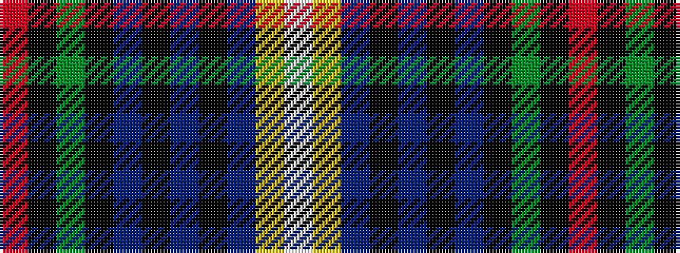

RKGKBKBKBYW

It is a 11 stripe tartan.

<figure class="pat-woven">

<figcaption>idealised sample</figcaption>
</figure>

## Colour Sequence



## Tartans with this colour sequence

| Tartans |
|---------------|
| [Tindal](/setts/s11/r3k2g18k18db3k3db3k3db18ly2w3~x2/)|
||
