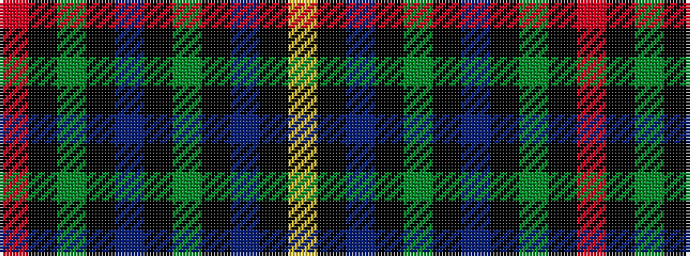

RKGKBKGKBKY

It is a 11 stripe tartan.

<figure class="pat-woven">

<figcaption>idealised sample</figcaption>
</figure>

## Colour Sequence



## Tartans with this colour sequence

| Tartans |
|---------------|
| [Ayrton (1979) (Personal)](/variants/s11/r4k2g25k2t10k2g4k2db25k2ly4~x2/)|
||
| [Ayrton (amended)](/variants/s11/r4k2dg25k2t10k2dg4k2db25k2ly4~x2/)|
||
