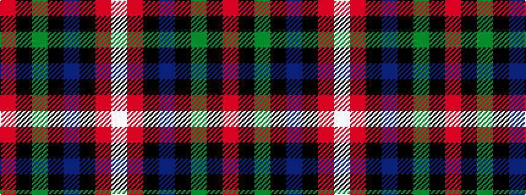

RKGKBKRW

It is a 8 stripe tartan.

<figure class="pat-woven">

<figcaption>idealised sample</figcaption>
</figure>

## Colour Sequence



## Tartans with this colour sequence

| Tartans |
|---------------|
| [Tennent (Personal)](/variants/s8/r1k7g7k7db7k7r1w1~x4/)|
||
