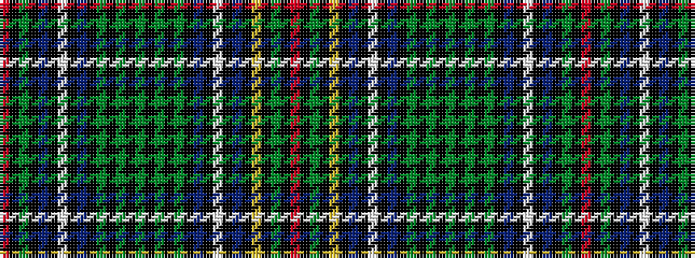

RKGKBKWKBKGKGKGKGKGKBKWKBKYKGKR

It is a 31 stripe tartan.

<figure class="pat-woven">

<figcaption>idealised sample</figcaption>
</figure>

## Colour Sequence



## Tartans with this colour sequence

| Tartans |
|---------------|
| [Cockburn](/variants/s31/r5k2g30k2ly5k2db31k2w5k2db31k6g2k2g2k2g86k2g2k2g2k6db31k2w5k2db31k6g25k2r5~x2/)|
||
| [Cockburn #3](/variants/s31/r5k2dg30k2ly5k2db31k2w5k2db31k6dg2k2dg2k2dg82k2dg2k2dg2k6db31k2w5k2db31k6dg25k2r5/)|
||
