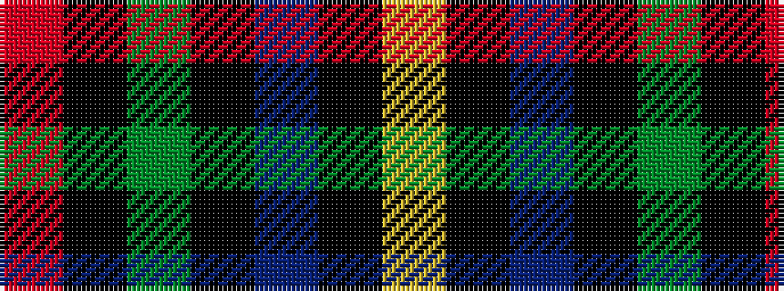

RKGKBKY

It is a 7 stripe tartan.

<figure class="pat-woven">

<figcaption>idealised sample</figcaption>
</figure>

## Colour Sequence



## Tartans with this colour sequence

| Tartans |
|---------------|
| [Green MacLeod](/setts/s7/ly4k2b20k10g15k2r3~x2/)|
||
| [MacLeod](/tartans/r3k2dg15k10db20k2ly2/)|
||
| [MacLeod](/setts/s7/r3k2dg15k10db21k1ly2/)|
||
| [MacLeod Small Clan Tartan Tartan Number: 15833. Earliest known date: See products available Copyright © Blair Urquhart, Comrie, 2015](/setts/s7/r1k1g7k5db10k1ly1~x2/)|
||
| [MacLeod, Macleod of Harris](/setts/s7/r3k2g15k10db20k2ly2~x2/)|
||
