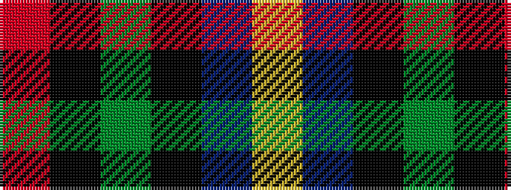

RKGKBY

It is a 6 stripe tartan.

<figure class="pat-woven">

<figcaption>idealised sample</figcaption>
</figure>

## Colour Sequence



## Tartans with this colour sequence

| Tartans |
|---------------|
| [MacLeod of Assynt](/setts/s6/r3k2g15k10db20ly2~x2/)|
||
| [MacLeod of Assynt](/setts/s6/r3k2g20k10b20ly2~x2/)|
||
| [Widows Sons Scotland (MRA)](/setts/s6/o9k16dg10k22dp67ly4/)|
||
