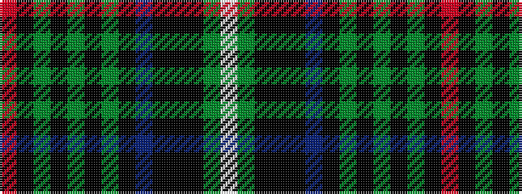

RKGKGKGKBKKKGW

It is a 14 stripe tartan.

<figure class="pat-woven">

<figcaption>idealised sample</figcaption>
</figure>

## Colour Sequence



## Tartans with this colour sequence

| Tartans |
|---------------|
| [Elgin - Landshut](/setts/s14/r1k6g1k1g1k1g6k1b1k1k3k3g3w1~x8/)|
||
