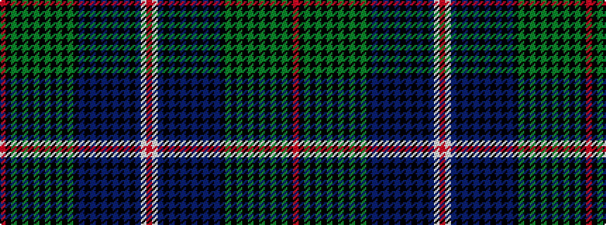

RKGKGKGKGKGKGKBKBKBKBKBKBWR

It is a 27 stripe tartan.

<figure class="pat-woven">

<figcaption>idealised sample</figcaption>
</figure>

## Colour Sequence



## Tartans with this colour sequence

This pattern is a design lineage: every tartan below shares one colour order, whatever its owner —
near-identical designs are grouped, the largest lineage first (#112: the pattern is a tartan's
second parent, beside its family or clan).

<table class="sett-table">
<tbody>
<tr><td><a href="/variants/s27/r8w2db34k1db5k2db4k3db3k4db2k5db1k36g1k5g2k4g3k3g4k2g5k1g34k4ri8~r2109032-ri2806019/">St. Andrews Soc. of New York (Corp)</a></td></tr>
<tr><td class="sett-swatch"></td></tr>
</tbody>
</table>

