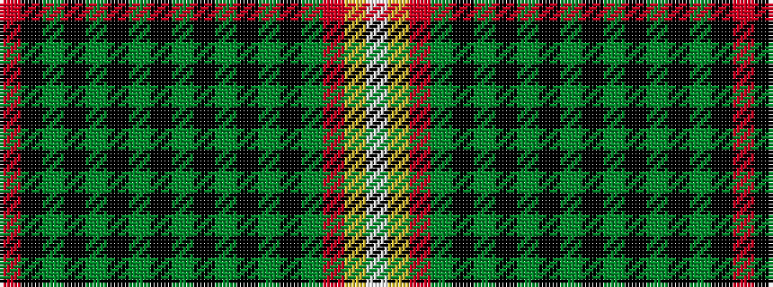

RKGKGKGKGKGKGKGRYW

It is a 18 stripe tartan.

<figure class="pat-woven">

<figcaption>idealised sample</figcaption>
</figure>

## Colour Sequence



## Tartans with this colour sequence

| Tartans |
|---------------|
| [Read Dress, Peter (Personal)](/setts/s18/r8k24y1k1y1k1y1k1y8k1y1k1y1k1y1r20lo1w1~x2/)|
||
