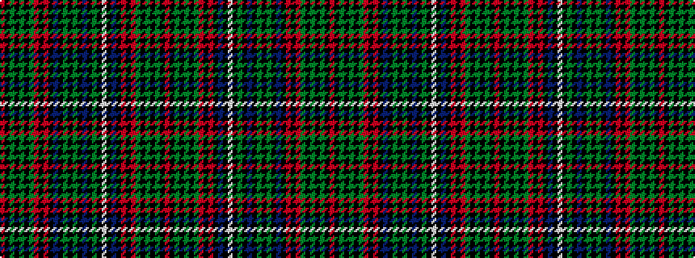

RKGKGKGRKRKBKGKGKBKGKWKBKRKRGKGKGKR

It is a 35 stripe tartan.

<figure class="pat-woven">

<figcaption>idealised sample</figcaption>
</figure>

## Colour Sequence



## Tartans with this colour sequence

This pattern is a design lineage: every tartan below shares one colour order, whatever its owner —
near-identical designs are grouped, the largest lineage first (#112: the pattern is a tartan's
second parent, beside its family or clan).

<table class="sett-table">
<tbody>
<tr><td><a href="/variants/s35/r2k6g2k2g14k1y1r1k1r1k3t9k1y2k1g11k1t2k1g11k1w2k1t9k1r1k1r1y1k1g14k2g2k6r2~x2/">Unidentified (R.J.Forsyth)</a></td></tr>
<tr><td class="sett-swatch"></td></tr>
<tr><td><a href="/variants/s35/r8k31g8k8g56k3y3r3k3r3k12db36k3y8k3g44k2db6k2g44k3w8k3db36k12r3k3r3y3k3g56k8g8k31r8~x2/">Unidentified Plaid 14</a></td></tr>
<tr><td class="sett-swatch"></td></tr>
</tbody>
</table>

