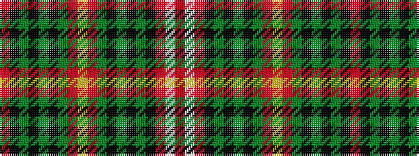

RKGKGKGRYRGKGKGKRWR

It is a 19 stripe tartan.

<figure class="pat-woven">

<figcaption>idealised sample</figcaption>
</figure>

## Colour Sequence



## Tartans with this colour sequence

| Tartans |
|---------------|
| [East Kilbride District Tartan Tartan Number: 2128. Earliest known date: 1990 East Kilbride district tartan was designed by Dr Gordon Teall, chairman of the Scottish Tartans Society, for the East Kilbride New Town Development Corporation. Prior to weaving the first bales of cloth, some modifications were made to the design to improve the appearance when woven in reproduction colours, taking the form of black guards and an addition black overcheck on the blue. (Blue appears dark gray or brown in reproduction colours). Both variations are represented in Dr Tealls book, District Tartans. Despite the very different appearance of the resulting fabric the sett design is essentially the same. See products available Copyright © Blair Urquhart, Comrie, 2015](/setts/s19/r20k2y10k2y10k2y15r21lo4r21y15k2y10k2y10k2r27w4r7~x2/)|
|![East Kilbride District Tartan Tartan Number: 2128. Earliest known date: 1990 East Kilbride district tartan was designed by Dr Gordon Teall, chairman of the Scottish Tartans Society, for the East Kilbride New Town Development Corporation. Prior to weaving the first bales of cloth, some modifications were made to the design to improve the appearance when woven in reproduction colours, taking the form of black guards and an addition black overcheck on the blue. (Blue appears dark gray or brown in reproduction colours). Both variations are represented in Dr Tealls book, District Tartans. Despite the very different appearance of the resulting fabric the sett design is essentially the same. See products available Copyright © Blair Urquhart, Comrie, 2015 example sett](/setts/s19/r20k2y10k2y10k2y15r21lo4r21y15k2y10k2y10k2r27w4r7~x2/sett.png)|
