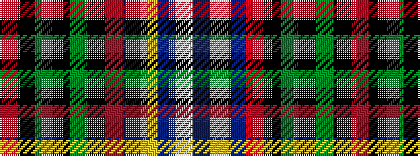

RKGKGKRBYBW

It is a 11 stripe tartan.

<figure class="pat-woven">

<figcaption>idealised sample</figcaption>
</figure>

## Colour Sequence



## Tartans with this colour sequence

| Tartans |
|---------------|
| [Kungsholmen Snooker Corporate Sports Tartan Tartan Number: 7216. Earliest known date: 2007 The sett is based on the game of snooker, the colours resemble professional competition snooker balls. The threadcount is based on the number 146, the maximum break with one pink ball. A revised sett, with six colours, is given for kilt making. (R8, K4, G4, K56, B56, Y8, B4, W16 HSFP) which excludes the brown and the pink. Sample woven in silk with 8 colours. See products available Copyright © Blair Urquhart, Comrie, 2015](/setts/s11/w4t1ly2t13ri1k13dy1k1g1k1r2~x4/)|
|![Kungsholmen Snooker Corporate Sports Tartan Tartan Number: 7216. Earliest known date: 2007 The sett is based on the game of snooker, the colours resemble professional competition snooker balls. The threadcount is based on the number 146, the maximum break with one pink ball. A revised sett, with six colours, is given for kilt making. (R8, K4, G4, K56, B56, Y8, B4, W16 HSFP) which excludes the brown and the pink. Sample woven in silk with 8 colours. See products available Copyright © Blair Urquhart, Comrie, 2015 example sett](/setts/s11/w4t1ly2t13ri1k13dy1k1g1k1r2~x4/sett.png)|
