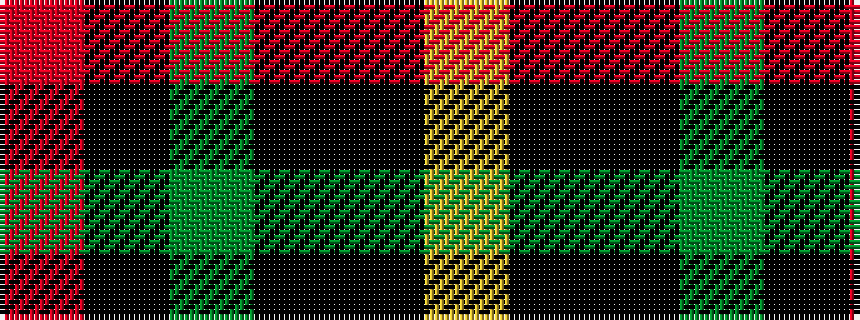

RKGKKY

It is a 6 stripe tartan.

<figure class="pat-woven">

<figcaption>idealised sample</figcaption>
</figure>

## Colour Sequence



## Tartans with this colour sequence

| Tartans |
|---------------|
| [Wcwm 9275 5471-2](/variants/s6/r4k2dg28k38k1ly4~x2/)|
||
