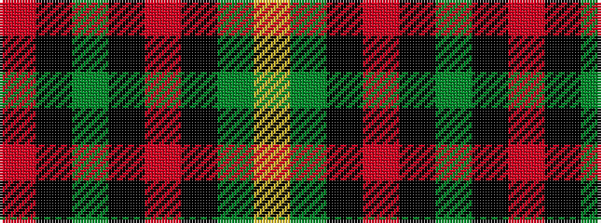

RKGKRKGY

It is a 8 stripe tartan.

<figure class="pat-woven">

<figcaption>idealised sample</figcaption>
</figure>

## Colour Sequence



## Tartans with this colour sequence

| Tartans |
|---------------|
| [Midpac Tissue (non woven)](/setts/s8/r5k2dg1k2r5k2dg18lo3~x2/)|
||
