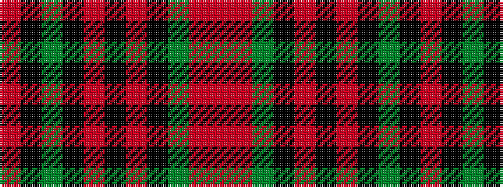

RKGKRKRKGRR

It is a 11 stripe tartan.

<figure class="pat-woven">

<figcaption>idealised sample</figcaption>
</figure>

## Colour Sequence



## Tartans with this colour sequence

| Tartans |
|---------------|
| [Fountain of the Strong](/setts/s11/o6k3dg3k6r2k2r2k6dg3o14r2~x2/)|
||
