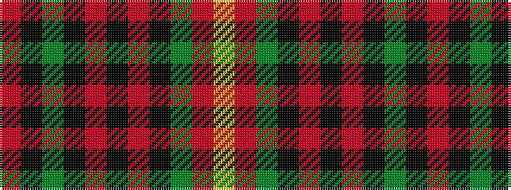

RKGKRKRKGRY

It is a 11 stripe tartan.

<figure class="pat-woven">

<figcaption>idealised sample</figcaption>
</figure>

## Colour Sequence



## Tartans with this colour sequence

| Tartans |
|---------------|
| [Finnegan](/variants/s11/o6k2g2k4r3k2r3k4g2o24ly2~x2/)|
||
