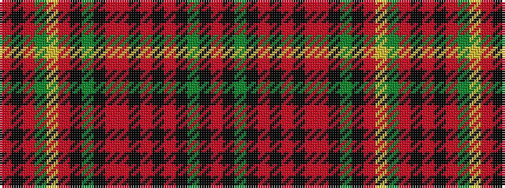

RKGKRKRKRRKGKRYGRKR

It is a 19 stripe tartan.

<figure class="pat-woven">

<figcaption>idealised sample</figcaption>
</figure>

## Colour Sequence



## Tartans with this colour sequence

| Tartans |
|---------------|
| [Craig](/setts/s19/r1k2o2g1ly1o17k1g14k1r2o2k1o2k1o2k2g2k2r1~x4/)|
||
| [Craig Family Tartan Tartan Number: 1574. Earliest known date: 1957 MacGregor Hastie wrote, "This tartan was designed by me to meet a long felt want. Many people have asked if there was a Craig family tartan, and as the name is not connected with any Highland clan, yet the the family name is numerous, it seemed a good idea to design one. The design is based on the general colour of craigs and rocks." The Craig tartan is now in general production. See products available Copyright © Blair Urquhart, Comrie, 2015](/setts/s19/r1k3g2k2o2k1o3k1o2r3k1g16k1o18ly1g1o2k2r1~x2/)|
|![Craig Family Tartan Tartan Number: 1574. Earliest known date: 1957 MacGregor Hastie wrote, "This tartan was designed by me to meet a long felt want. Many people have asked if there was a Craig family tartan, and as the name is not connected with any Highland clan, yet the the family name is numerous, it seemed a good idea to design one. The design is based on the general colour of craigs and rocks." The Craig tartan is now in general production. See products available Copyright © Blair Urquhart, Comrie, 2015 example sett](/setts/s19/r1k3g2k2o2k1o3k1o2r3k1g16k1o18ly1g1o2k2r1~x2/sett.png)|
