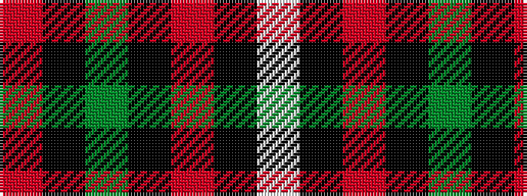

RKGKRKW

It is a 7 stripe tartan.

<figure class="pat-woven">

<figcaption>idealised sample</figcaption>
</figure>

## Colour Sequence



## Tartans with this colour sequence

| Tartans |
|---------------|
| [Genet, Edmond Charles 'Citizen' (Personal)](/setts/s7/r4k9dg9k40r2k2w2~x2/)|
||
