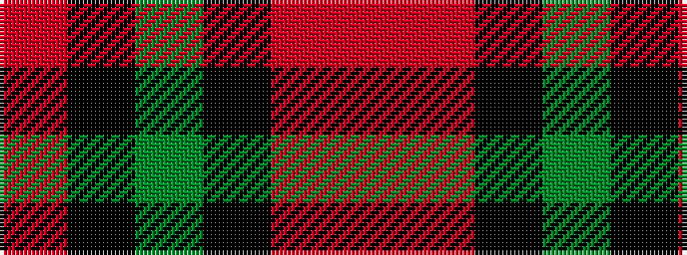

RKGKRR

It is a 6 stripe tartan.

<figure class="pat-woven">

<figcaption>idealised sample</figcaption>
</figure>

## Colour Sequence



## Tartans with this colour sequence

| Tartans |
|---------------|
| [205 (Scottish) Field Hospital (Mil.)](/setts/s6/o3ri18k2dg18k24r1~x2/)|
||
