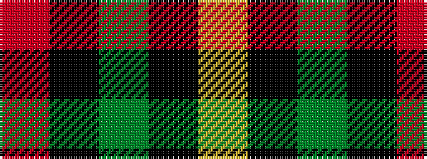

RKGKY

It is a 5 stripe tartan.

<figure class="pat-woven">

<figcaption>idealised sample</figcaption>
</figure>

## Colour Sequence



## Tartans with this colour sequence

| Tartans |
|---------------|
| [Daks, Black (Fashion)](/setts/s5/r3k6dy4k6ly3~x2/)|
||
| [Mar Tribe](/setts/s5/r2k3g45k3ly2/)|
||
| [Mar, (Tribe of..)](/tartans/r2k4g45k3ly2/)|
||
| [Skene or Tribe of Mar](/setts/s5/r1k2dg16k2ly1~x2/)|
||
| [Skene, or Tribe of Mar](/setts/s5/r1k2g16k2ly1~x2/)|
||
