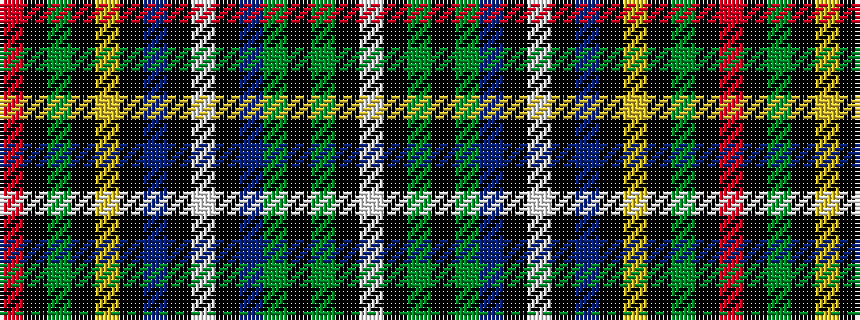

RKGKYKBKWKBGKGKW

It is a 16 stripe tartan.

<figure class="pat-woven">

<figcaption>idealised sample</figcaption>
</figure>

## Colour Sequence



## Tartans with this colour sequence

| Tartans |
|---------------|
| [Cockburn of Ormiston Dress](/variants/s16/w31k2g2k2g2db8k2w2k2db8k2ly2k2g8k2r2~x2/)|
||
