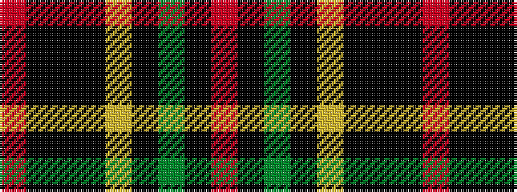

RKGKYKKKR

It is a 9 stripe tartan.

<figure class="pat-woven">

<figcaption>idealised sample</figcaption>
</figure>

## Colour Sequence



## Tartans with this colour sequence

| Tartans |
|---------------|
| [Strachan](/setts/s9/r2k3k40k3ly2k3dg20k3r2~x2/)|
||
