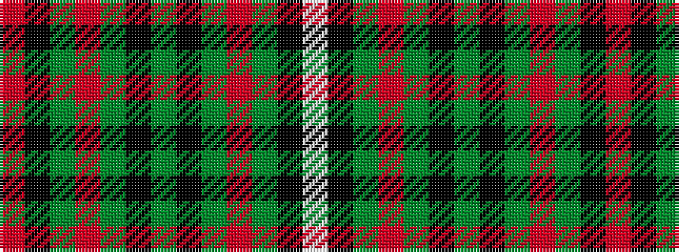

RKGRGKGKGRGKW

It is a 13 stripe tartan.

<figure class="pat-woven">

<figcaption>idealised sample</figcaption>
</figure>

## Colour Sequence



## Tartans with this colour sequence

| Tartans |
|---------------|
| [Crihfield Family (Personal)](/setts/s13/o4k2g6o3g10k10g4k10g10o3g6k2lb4~x2/)|
||
