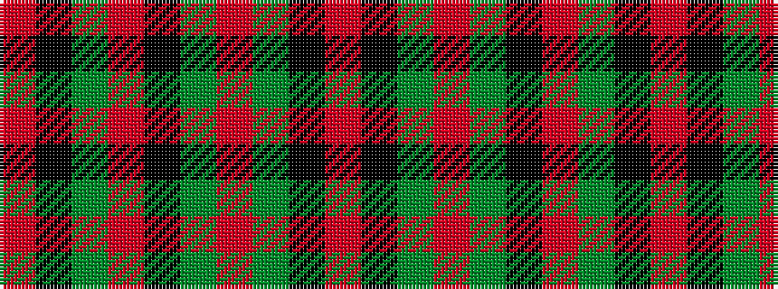

RKGRGKRGKR

It is a 10 stripe tartan.

<figure class="pat-woven">

<figcaption>idealised sample</figcaption>
</figure>

## Colour Sequence



## Tartans with this colour sequence

| Tartans |
|---------------|
| [Moulin](/setts/s10/o36k3dy3r1dy3k3o4dy6k1r2~x4/)|
||
